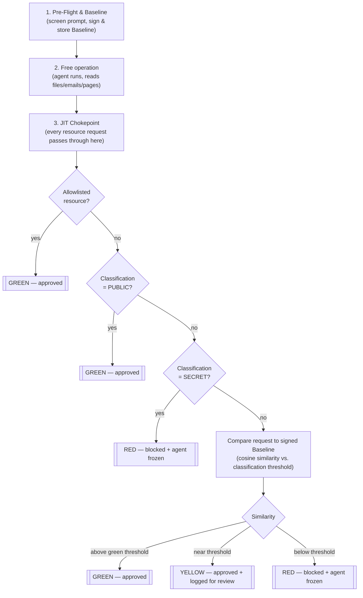

# Alpha-Flow Engine (AFE)

An application-layer (Layer 7) security gate that sits between an AI agent and a sensitive resource, and checks not "is there permission" — but "does what the agent is trying to do right now still match what it was sent to do."

**[Demo video/GIF — coming soon]**

## The Problem

Classic security tools check permissions at the network/identity level: does the agent technically have access? If yes, it passes — blind to intent. That gap lets two very different attacks through with the exact same valid permissions: an **insider threat** (an employee plants a hidden instruction in the original prompt) and **indirect prompt injection** (an attacker plants hidden instructions in a file, email, or page the agent reads mid-task). Neither trips a permissions check, because nothing about *permission* changed.

## The Solution

AFE is a mandatory chokepoint between the agent and every classified resource, validating **Just-In-Time** — not only at creation — whether the current request still matches the task the agent was signed for. It's agnostic to where a deviation comes from: a poisoned document and a rogue employee both reduce to the same signature (drift from the signed task), so the same mechanism catches both without needing to know which one it's looking at.



## Quick start

Create a virtual environment and install AFE in editable mode:

```bash
python -m venv .venv
source .venv/bin/activate   # Windows: .venv\Scripts\activate
pip install -e .
```

Create a `.env` file at the repo root — it is gitignored and never committed. Two secrets go in it, and they aren't equivalent:

**1. `ANTHROPIC_API_KEY`** — used only by the demo harness to call the Claude API:

```bash
ANTHROPIC_API_KEY=sk-...
```

**2. `AFE_HMAC_SECRET`** — this one isn't a plug-and-play value. `config/classification.json` and `config/thresholds.json` are already HMAC-signed and committed to this repo, signed with the original author's secret (not published). If you set your own `AFE_HMAC_SECRET`, AFE will fail to verify those files' existing signatures and refuse to start — by design, fail-secure: a mismatched secret is indistinguishable from a tampered policy (see [docs/concept.md §2.4](docs/concept.md#24-core-principle-the-rules-themselves-are-locked-too-not-just-the-badge)). Pick your own value, then re-sign both policy files with it before running anything:

```bash
AFE_HMAC_SECRET=<pick any value>   # add to .env
python scripts/sign_policy.py config/classification.json
python scripts/sign_policy.py config/thresholds.json
```

Run the six-scenario end-to-end demo (real Claude API calls, real signed Baselines, real chokepoint):

```bash
python demo/run_demo.py
```

Run the threshold-calibration eval set:

```bash
python eval/run_eval.py
```

Run the test suite:

```bash
pytest -v
```

## Results

Day 11's threshold calibration started at **60% accuracy (12/20)** against the evaluation set — not a decision-logic flaw. All 20 raw similarity scores were checked, and the relative ranking was fully correct (on-topic requests always scored higher than off-topic ones); the initial thresholds were just calibrated to the wrong scale for how cosine similarity behaves on short `tool_name(args)`-style descriptions. Recalibrating the thresholds to the observed score range brought accuracy to **90% (18/20)**, with **100% recall on RED** — no dangerous request was ever misclassified as safe.

The two remaining errors are deliberate, not bugs: one is a genuine label contradiction in the eval set resolved toward over-blocking (fail-secure); the other is a known edge case where a `query_db` query's raw argument text happens to overlap with the task wording more than it semantically should.

## Known limitations

The most consequential one: **`allowed_resources` is an explicit trust grant that outranks classification and similarity by design** — a mistake made when the allowlist is defined is not caught by any other layer. AFE's threat model also assumes an attacker who can influence the agent's *inputs*, not one with simultaneous direct access to the filesystem and the HMAC signing secret. And semantic checking itself is inherently probabilistic — the deterministic checks (allowlist, classification, fail-secure) are the layer actually doing the hard guarantees. Full list: [docs/concept.md#11-known-limitations](docs/concept.md#11-known-limitations).

## Roadmap

- **Real network enforcement** — a reverse proxy in front of real MCP servers, not just internal logic
- **Policy authority separation** — the signed policy and its signing key move to a physically/logically separate system the AFE host can only read from, never write to
- **Tamper-evident audit log** — chained signing, so deleting a log line breaks the chain
- **A local LLM for the agent's brain itself**, and **integration as a hook in real coding-agent tools** (e.g. Claude Code's `PreToolUse`) — closing off the network on the agent side too, and letting AFE's chokepoint logic protect a real deployed agent, not just the demo harness

## License

MIT License — see [LICENSE](LICENSE).
